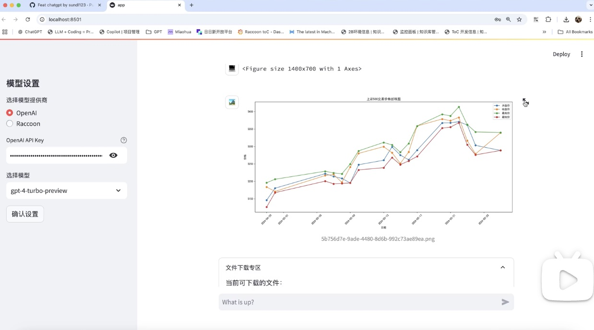
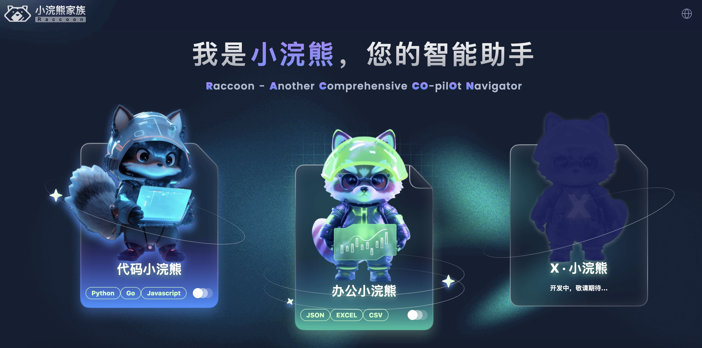

<div align="center">

<p align="center">

</p>

# Free AI Coder

A free chatgpt code interpreter implementation, which runs locally on your computer for better privacy

</div>

## Demo

[](https://www.bilibili.com/video/BV1UjFPemEXC)

## Quick Start

```bash

# install from pypi
pip install --upgrade jupyter_enterprise_gateway

# show all config options
jupyter enterprisegateway --help-all

# run it with default options
jupyter enterprisegateway --port 8889

# start the app
python3.11 -m streamlit run app.py
```

## Feature

1. 支持对接各种不同的通用AI model(后续计划支持Claude 3.5, Gemini Pro，当然也欢迎PR)
2. Privacy，数据文件不上传云端，支持本地运行python sandbox，执行数据分析。
3. 支持沙盒文件上传/下载
4. 集成matplotlib, 用于展示画图功能
5. 支持多个不同的会话同时运行，支持不同会话之间的数据隔离

## Other Recommendations

如果你不想要想要自己搭建本地沙盒环境，或者没有自己的OpenAI的API Key, 推荐使用商汤科技的办公小浣熊，https://xiaohuanxiong.com/office


商汤的办公小浣熊是一款基于大语言模型的智能数据分析工具，旨在简化数据分析过程，使用户无需编程或复杂操作即可进行数据分析。以下是办公小浣熊的主要特点和功能：

1. 自然语言交互：用户可以通过自然语言描述他们的数据分析需求，办公小浣熊能够理解这些需求并执行相应的数据分析任务。
2. 多文件格式支持：支持多种文件格式，如xls、xlsx、csv、txt、json等，方便用户上传和分析数据。
3. 数据清洗与运算：帮助用户清洗数据，去除无效或错误的数据，并执行各种数学运算，如求和、平均值、中位数等。
4. 趋势分析与预测：分析数据随时间的变化趋势，帮助用户识别模式，并基于历史数据进行预测。
5. 数据可视化：将分析结果转化为直观的图表，如柱状图、折线图、饼状图等，以便用户更清晰地理解数据内容。
6. 多表分析：支持对多个表格或多个工作表的数据进行综合分析。

办公小浣熊适用于多种应用场景，如项目管理、采购、销售以及年终总结等办公场景，可以迅速、高效地完成这些任务。它不仅适用于职场打工人提升办公效率，也适用于普通用户在日常生活中体验数据分析的价值。例如，孩子们可以通过办公小浣熊管理压岁钱，自媒体工作者可以分析内容的阅读量和互动量，企业则可以利用它进行项目管理、采购管理、销售预测等


## Others

- 如何安装中文字体，参考这个: [Mac系统中Matplotlib/Plotly下载以及中文显示乱码问题_mac系统python plot字体下载-CSDN博客](https://blog.csdn.net/weixin_47751174/article/details/123965843)

## Special Thanks

我从这个项目得到了启发[ricklamers/gpt-code-ui](https://github.com/ricklamers/gpt-code-ui)，感谢ricklamer开源了该项目，也希望大家支持这个项目。
